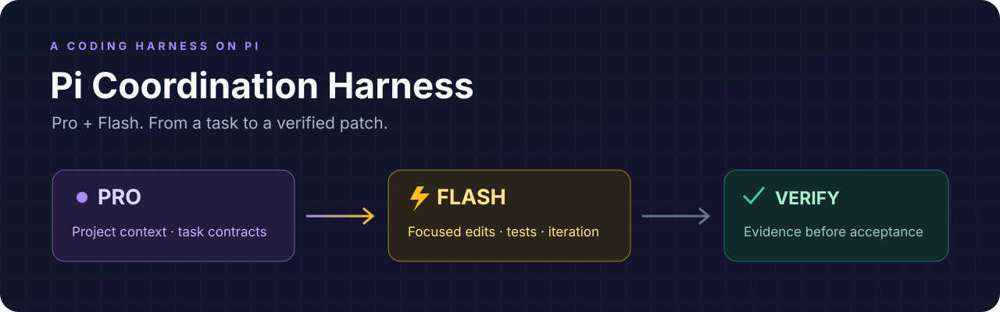
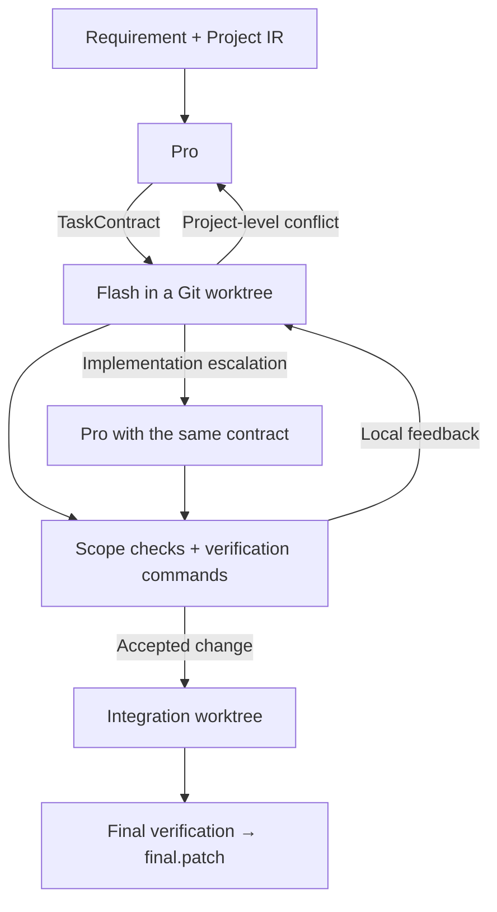

<p align="center">
  
</p>

<h1 align="center">Pi Coordination Harness</h1>
<p align="center"><strong>Pro + Flash. From a task to a verified patch.</strong></p>
<p align="center">
  <strong>English</strong> · <a href="README.zh-CN.md">简体中文</a>
</p>
<p align="center">
  <a href="LICENSE"></a>
  
</p>


**Pi Coordination Harness turns Pro / Flash collaboration into a coding workflow you can run from the terminal.** Give it a repository and a requirement: Pro shapes the work, Flash implements it, and verification gates the patch you receive.

Persistent project context, task contracts, isolated Git worktrees, model handoffs, and patch output are coordinated by the runtime. The same collaboration approach is available as the **Model Coordination Skill** Agent Skill for other coding hosts.

<p align="center"><a href="#what-you-get">What you get</a> · <a href="#quick-start">Quick start</a> · <a href="#follow-a-task-through-the-runtime">The workflow</a> · <a href="#inspect-the-result">Your result</a></p>

## What you get

| Capability | Why it matters |
| --- | --- |
| **Pro / Flash collaboration** | Assign project-level decisions to Pro and focused implementation to Flash. |
| **Persistent Project IR** | Keep architecture, interfaces, and decisions available across requests. |
| **A session for each task** | Flash retains its local edit/test/debug context through retries. |
| **Temporary Git worktrees** | Candidate changes stay separate from your original checkout. |
| **Verification before integration** | Check write scope, inspect changes, and run task-specific commands. |
| **A patch to review** | Get `final.patch` alongside task outcomes and verification records. |

The key idea is **selective collaboration**: Flash handles the iteration inside a task; Pro returns when the project needs a new decision. You can also configure a Pro model to take over a difficult implementation while keeping its existing contract.

## Quick start

**Environment:** Node 22.19+, npm, Git, and bash on Linux or macOS; use WSL2 on Windows. Configure your model authentication in Pi. On Linux, install `bubblewrap`, `socat`, and `ripgrep` for the shell sandbox.

### 1. Build the harness

Download or clone this repository, then run:

```sh
npm ci
npm run build
cp pi-coordination.config.example.json pi-coordination.config.json
```

### 2. Choose your Pro and Flash models

Edit `pi-coordination.config.json` using provider/model IDs available in your Pi environment. The minimal shape is:

```json
{
  "pro": {
    "provider": "YOUR_PRO_PROVIDER",
    "model": "YOUR_PRO_MODEL"
  },
  "flash": {
    "provider": "YOUR_FLASH_PROVIDER",
    "model": "YOUR_FLASH_MODEL"
  },
  "verification": {
    "finalCommands": ["npm test"]
  }
}
```

Replace the model placeholders and set the verification commands for **your target project**. The [full example](pi-coordination.config.example.json) includes sandbox and retry settings. Add `proWorker` when you want a Pro model to handle implementation escalations. Pro and Flash describe roles; they do not lock you to a provider.

### 3. Give it a task

Use a target Git repository with at least one commit. From the harness directory:

```sh
node dist/cli.js run \
  --repo /path/to/your-project \
  --config ./pi-coordination.config.json \
  --requirement "Add cursor pagination to search while preserving existing response fields"
```

For a longer brief, use `--requirement-file request.md`. Prefer a named command? Run `npm link` and use `pi-coordination-harness run ...`.

## Follow a task through the runtime



For a change such as pagination, Pro identifies the API and data-layer boundaries, then describes the change through task contracts. Flash works on those contracts with the relevant source context. If tests fail, the evidence returns to its existing session. If the task exposes an interface conflict, Pro gets the evidence needed to revise the affected plan.

Accepted task commits are combined in an integration worktree. Final checks run there before the runtime exports the patch.

## Inspect the result

The command returns the run ID, accepted task IDs, patch path, and metrics path. Artifacts stay under the target repository:

```text
.agent-orch/
  project/                    # reusable project knowledge
  runs/<run-id>/
    requirement.md            # your original request
    plan.json                 # the task graph
    tasks/                    # task contracts
    outcomes/                 # model-reported results
    *.verification.json       # checks and evidence
    metrics.json              # role usage statistics
    final.patch               # the change to review
```

Review the patch, then apply it in the target repository with the returned run ID:

```sh
git apply --check .agent-orch/runs/<run-id>/final.patch
git apply .agent-orch/runs/<run-id>/final.patch
```

Worktrees start from committed `HEAD`; commit the changes you want included before starting a run. If task context should stay local, add `.agent-orch/` to the target's ignore rules.

## Built to be understood and changed

The coordination loop lives in TypeScript. Role prompts are separate Markdown files. You can inspect both the runtime's decisions and the instructions each model receives.

| Directory | Explore it to change |
| --- | --- |
| `src/runtime/` | Task scheduling, retry routing, artifacts, and metrics |
| `src/planner/` · `src/worker/` | Pro / Flash sessions and tool contracts |
| `src/workspace/` · `src/verifier/` | Candidate worktrees, acceptance, and patch export |
| `prompts/` | Project understanding, task handoffs, and model instructions |

```sh
npm run check
```

Start with [architecture](docs/ARCHITECTURE.md) or [prompt design](docs/PROMPT_DESIGN.md). Contributions to model routing, integrations, and verification are welcome: [CONTRIBUTING.md](CONTRIBUTING.md).

Built on [Pi](https://github.com/earendil-works/pi), with [MIT-licensed](LICENSE) source.

<sub>Current compatibility, verification coverage, and runtime boundaries are documented in the [validation notes](docs/VALIDATION.md).</sub>
