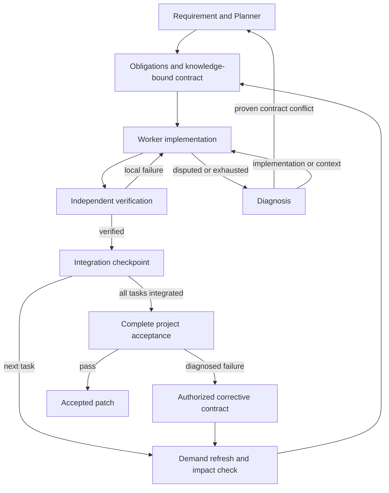

<p align="center">
  
</p>

<h1 align="center">Pi Coordination Harness</h1>
<p align="center"><strong>Pro + Flash. From a task to a verified patch.</strong></p>
<p align="center">
  <strong>English</strong> · <a href="README.zh-CN.md">简体中文</a>
</p>
<p align="center">
  <a href="LICENSE"></a>
  
</p>


**Pi Coordination Harness turns Pro / Flash collaboration into a coding workflow you can run from the terminal.** Give it a repository and a requirement: Pro shapes the work, Flash implements it, and verification gates the patch you receive.

V0.3 closes the requirement, knowledge, contract, diagnosis and integration loops. Independent evidence review gates semantic claims, final failures enter bounded repair, and Git checkpoints support explicit resume. See [architecture](docs/ARCHITECTURE.md), [the implementation plan](docs/IMPLEMENTATION_PLAN.md) and [the full Chinese mechanism](docs/MECHANISM.zh-CN.md).

<p align="center"><a href="#what-you-get">What you get</a> · <a href="#quick-start">Quick start</a> · <a href="#follow-a-task-through-the-runtime">The workflow</a> · <a href="#inspect-the-result">Your result</a></p>

## What you get

| Capability | Why it matters |
| --- | --- |
| **Role-specific loops** | Event-driven Pro decisions and persistent Flash implementation/retry sessions. |
| **Architecture-first Planner** | Query modules, interfaces, invariants and impact; request narrow evidence instead of browsing source. |
| **Fast knowledge and evidence roles** | Separate read-only Knowledge Builder and Scout sessions, using Flash by default. |
| **Layered Project IR v3** | Separate hypotheses, corroborated facts, dirty records and authored decisions; refresh on demand. |
| **A session for each task** | Flash retains its local edit/test/debug context through retries. |
| **Temporary Git worktrees** | Candidate changes stay separate from your original checkout. |
| **Obligation-based verification** | Require explicit coverage/evidence for requirements, acceptance and constraints. |
| **Diagnosed project repair** | Classify failures before escalation; repeat complete original acceptance after correction. |
| **Resumable integration** | Retain Git/checkpoint progress and skip integrated tasks on resume. |
| **A patch to review** | Get `final.patch` alongside task outcomes and verification records. |

The key idea is **selective collaboration**: Flash handles the iteration inside a task; Pro returns when the project needs a new decision. You can also configure a Pro model to take over a difficult implementation while keeping its existing contract.

## Quick start

**Environment:** Node 22.19+, npm, Git, and bash on Linux or macOS; use WSL2 on Windows. Configure your model authentication in Pi. On Linux, install `bubblewrap`, `socat`, and `ripgrep` for the shell sandbox.

### 1. Build the harness

Download or clone this repository, then run:

```sh
npm ci
npm run build
cp pi-coordination.config.example.json pi-coordination.config.json
```

### 2. Choose your Pro and Flash models

Edit `pi-coordination.config.json` using provider/model IDs available in your Pi environment. The minimal shape is:

```json
{
  "pro": {
    "provider": "YOUR_PRO_PROVIDER",
    "model": "YOUR_PRO_MODEL"
  },
  "flash": {
    "provider": "YOUR_FLASH_PROVIDER",
    "model": "YOUR_FLASH_MODEL"
  },
  "verification": {
    "finalCommands": ["npm test"]
  }
}
```

Replace the model placeholders and set the verification commands for **your target project**. The [full example](pi-coordination.config.example.json) includes sandbox and retry settings. Add `proWorker` when you want a Pro model to handle implementation escalations. Pro and Flash describe roles; they do not lock you to a provider. Optional `scout` selects a separate fast profile for knowledge/evidence; otherwise Flash is used. Optional `reviewer` selects independent semantic assessment, defaulting to Pro. `plannerContext` defaults to architecture/source budgets of 12000/2000 conservative UTF-8 byte units and 6 evidence requests per decision; these are proxies rather than provider token counts.

### 3. Give it a task

Use a target Git repository with at least one commit. From the harness directory:

```sh
node dist/cli.js run \
  --repo /path/to/your-project \
  --config ./pi-coordination.config.json \
  --requirement "Add cursor pagination to search while preserving existing response fields"
```

For a longer brief, use `--requirement-file request.md`. Prefer a named command? Run `npm link` and use `pi-coordination-harness run ...`.

## Follow a task through the runtime



Plans enumerate requirements and mandatory project obligations. Tasks map acceptance/constraints to commands, literal assertions or independent reviews. Candidate self-report is never acceptance: mandatory evidence, actual scope and unchanged verification state gate integration.

Integration dirties affected knowledge. The next task demands its dependencies; changed hashes invalidate only affected pending contracts, which receive new versions/sessions. Worker conflict claims require independent base-backed diagnosis before a semantic Planner event.

Final acceptance repeats original project obligations and integrated task checks. Failures create authorized corrective tasks followed by complete reverification, defaulting to two rounds. Checkpoints retain progress. Only complete acceptance activates supported decisions and exports the patch.

## Inspect the result

The command returns the run ID, accepted task IDs, patch path, and metrics path. Artifacts stay under the target repository:

| Location | Content |
| --- | --- |
| `.agent-orch/project/` | Revision-tagged knowledge/evidence caches and authored decisions |
| `.agent-orch/runs/<run-id>/tasks/`, `outcomes/` | Dispatched contracts and local execution history |
| `*.verification.json`, `evidence/`, `diagnostic-*.json` | Observed checks, evidence and diagnosis |
| `planner-*`, `plan-delta-*`, `project-delta-*` | Views, deferrals, events and impacts |
| `checkpoint.json`, `task-state-*`, `metrics.json` | Recovery, task phases and role metrics |
| `final.patch` | Patch exported after project acceptance |

After fixing an external/environment issue, resume with the original config/base HEAD:

```sh
node dist/cli.js resume --repo /path/to/your-project \
  --config ./pi-coordination.config.json --run-id <run-id>
```

Integration is retained at `refs/pi-coordination/runs/<run-id>/integration`. Resume skips integrated work; early failure before a valid plan/checkpoint requires a new run after remediation.

Review the patch, then apply it in the target repository with the returned run ID:

```sh
git apply --check .agent-orch/runs/<run-id>/final.patch
git apply .agent-orch/runs/<run-id>/final.patch
```

Worktrees start from committed `HEAD`; commit the changes you want included before starting a run. If task context should stay local, add `.agent-orch/` to the target's ignore rules.

## Built to be understood and changed

The coordination loop lives in TypeScript. Role prompts are separate Markdown files. You can inspect both the runtime's decisions and the instructions each model receives.

| Directory | Explore it to change |
| --- | --- |
| `src/runtime/` | Task scheduling, retry routing, artifacts, and metrics |
| `src/planner/` · `src/worker/` | Pro architecture queries, evidence tools and Flash task loops |
| `src/project/` | Durable IR, committed-source indexing, Knowledge Builder and Evidence Scout |
| `src/workspace/` · `src/verifier/` | Candidate worktrees, acceptance, and patch export |
| `prompts/` | Project understanding, task handoffs, and model instructions |

```sh
npm run check
```

Start with [architecture](docs/ARCHITECTURE.md), [protocol and conformance](docs/PROTOCOL.md), or [prompt design](docs/PROMPT_DESIGN.md). Contributions to model routing, integrations, and verification are welcome: [CONTRIBUTING.md](CONTRIBUTING.md).

Built on [Pi](https://github.com/earendil-works/pi), with [MIT-licensed](LICENSE) source.

<sub>Current compatibility, verification coverage, and runtime boundaries are documented in the [validation notes](docs/VALIDATION.md).</sub>

## Upgrade from V0.1 / V0.2

Existing JSON config receives default diagnosis/repair/deferral budgets. Legacy IR becomes v3 candidates; unauthored decisions remain superseded background. String-only criteria are insufficient: new plans require obligation coverage. Old runs have no resumable checkpoints. Programmatic callers must update HarnessConfig, ProjectPlan and TaskContract fields.

Caches can describe proposed integration rather than the original checkout. Applying/committing a patch enables same-tree evidence reuse. Live model quality, OS sandbox enforcement and cost gains require separate validation; see [validation notes](docs/VALIDATION.md).
