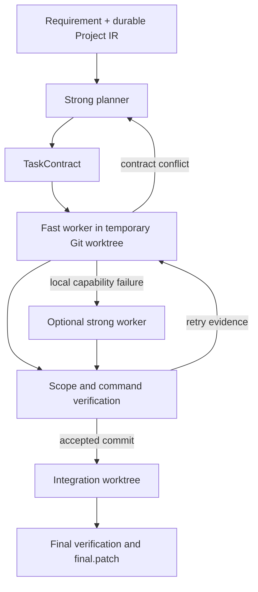

# Pi Role Harness

English | [简体中文](README.zh-CN.md)

A **role-specialized coding harness on Pi**: a strong planner makes project-level decisions, fast workers own local implementation loops, and deterministic checks gate the resulting patch.

**Status: experimental 0.1.0 · MIT · Linux/macOS runtime.** Real-provider end-to-end operation is not yet certified. Windows users should run in WSL2 with Linux Node and Git. This repository is independent of the Pi project.

## Architecture



Project IR records architecture and evidence across requests. The planner wakes for a decision; each worker keeps its own task-local edit/test/debug session. Contracts, outcomes, and plan deltas carry coordination data instead of full conversation transcripts. Workers execute sequentially in this version.

## Prerequisites

- Node **22.19+**, npm, Git, and bash.
- Pi SDK baseline: `@earendil-works/pi-coding-agent` **0.85.1** (pinned in the lockfile).
- Model authentication configured for Pi; choose provider/model IDs that your Pi installation can resolve.
- Linux sandbox dependencies: `bubblewrap`, `socat`, and `ripgrep`; macOS uses its supported sandbox backend. Sandbox initialization must succeed with `sandbox.enabled: true`.
- A target Git repository with at least one commit. Work starts from committed `HEAD`; uncommitted changes are not copied into worktrees.

## Install from source

```sh
npm ci
npm run check
cp role-harness.config.example.json role-harness.config.json
```

Edit the configuration for your available planner and worker models. `strongWorker` is optional. The supplied model IDs are illustrative, not a promise of account access. Set `verification.finalCommands` to commands appropriate to the target repository (for example, its test/build commands). An empty list adds no user-configured final checks; only commands supplied by the plan will run.

Keep authentication in Pi's credential storage or provider environment variables, not this repository. Model calls can incur provider charges and disclose selected repository context.

## Run

From this harness repository:

```sh
node dist/cli.js run \
  --repo /path/to/target-repository \
  --config ./role-harness.config.json \
  --requirement "Add pagination while preserving the existing CLI"
```

Use `--requirement-file /path/to/request.md` for a longer request. `node dist/cli.js --help` shows the CLI syntax. For a shell command, run `npm link` locally and then use `pi-role-harness run ...`.

Workers edit temporary worktrees. The harness writes run artifacts under the target's `.agent-orch/` and returns a patch path:

```text
<repo>/.agent-orch/runs/<run-id>/final.patch
```

Review the patch and check it against your current worktree before applying:

```sh
git apply --check .agent-orch/runs/<run-id>/final.patch
git apply .agent-orch/runs/<run-id>/final.patch
```

Replace `<run-id>` with the returned ID. Applying is an explicit user step. Add `.agent-orch/` to the target's ignore rules if its task/context artifacts should stay private.

## Verification and isolation

Task verification includes tracked, staged, and untracked files, and checks the write scope again after verification commands. Temporary Git worktrees separate candidate edits from the original checkout. Pi file tools have path guards; bash uses `@anthropic-ai/sandbox-runtime` when enabled. Disabling it removes the OS sandbox layer.

A worktree is not a security boundary by itself. Planner inspection and model-provider communication are not isolated by the worker shell sandbox. The application is experimental and is not a hardened boundary for hostile repositories. Verification commands must match the project and may need dependency setup inside a temporary worktree; ignored dependencies are not copied from the source checkout.

## Development and limits

```sh
npm run check
npm pack --dry-run
```

Source is in `src/`, role prompts in `prompts/`, and deterministic tests in `test/`. Packaged prompts are runtime assets. See [architecture](docs/ARCHITECTURE.md), [prompt design](docs/PROMPT_DESIGN.md), [validation](docs/VALIDATION.md), and [contributing](CONTRIBUTING.md).

Current limits: sequential workers; file-level IR refresh; no rollback of already accepted tasks during replanning; bounded retries but no per-provider token/cost ceiling; no UI. The Skill's snake_case artifacts and this runtime's camelCase artifacts are separate formats. No cost or quality benchmark is claimed. See [references](docs/REFERENCES.md). Licensed under [MIT](LICENSE).
