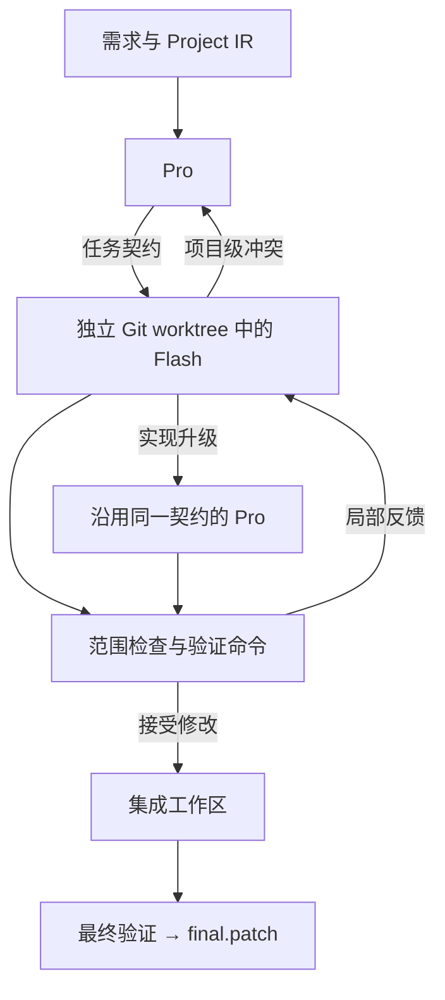

<p align="center">
  
</p>

<h1 align="center">Pi Coordination Harness</h1>
<p align="center"><strong>Pro 与 Flash 协作，把需求推进成可验证的补丁。</strong></p>
<p align="center">
  <a href="README.md">English</a> · <strong>简体中文</strong>
</p>
<p align="center">
  <a href="LICENSE"></a>
  
</p>


**Pi Coordination Harness 将 Pro / Flash 协作变成一套可以从终端运行的开发流程。** 给它一个仓库和一项需求：Pro 组织任务，Flash 推进实现，通过验证后交付补丁。

V0.2 将 Pro 设为短生命周期的架构决策角色：独立的快速 Knowledge Builder 读取已提交源码，Pro 消费 Architecture View 并按需请求结构化证据；Flash 在局部任务会话中持续检索、编辑、测试与修复。任务契约、独立 Git worktree 与独立验证连接两类循环。同一套协作思路也提供 **Model Coordination Skill** Agent Skill，方便在其他编码宿主中使用。

<p align="center"><a href="#你能得到什么">核心能力</a> · <a href="#快速开始">快速开始</a> · <a href="#一项需求如何流转">协作流程</a> · <a href="#查看与应用结果">交付结果</a></p>

## 你能得到什么

| 能力 | 带来的价值 |
| --- | --- |
| **角色专用 Agent loop** | Pro 按项目事件完成决策后退出，Flash 在任务内保留实现与调试历史。 |
| **架构层 Planner** | 查询模块、接口、约束与影响范围，通过 Evidence Request 按需获取证据。 |
| **独立知识与检索角色** | Knowledge Builder 和 Scout 使用只读快模型会话，默认采用 Flash 配置。 |
| **持久化 Project IR v2** | 沉淀模块职责、接口归属、依赖、能力与决策，并在验收集成后更新。 |
| **每项任务独立会话** | Flash 在重试中保留自己的编辑、测试和调试上下文。 |
| **临时 Git worktree** | 候选修改在独立工作区进行，与原始 checkout 分开。 |
| **先验证，再集成** | 检查写入范围、审查变化，并执行任务指定的验证命令。 |
| **可审阅的补丁** | 获得 `final.patch`，同时保留任务结果与验证记录。 |

核心在于**按需协作**：任务内的迭代交给 Flash，需要项目级决策时再由 Pro 参与。遇到复杂的局部实现，也可以保留原有任务契约，配置 Pro 模型接手。

## 快速开始

**运行环境：** Linux 或 macOS 上的 Node 22.19+、npm、Git 和 bash；Windows 使用 WSL2。在 Pi 中配置模型认证。Linux shell 沙箱还需要 `bubblewrap`、`socat`、`ripgrep`。

### 1. 构建框架

下载或克隆本仓库后执行：

```sh
npm ci
npm run build
cp pi-coordination.config.example.json pi-coordination.config.json
```

### 2. 选择 Pro 与 Flash 模型

编辑 `pi-coordination.config.json`，填入自己在 Pi 环境中可用的供应商和模型 ID。最小配置如下：

```json
{
  "pro": {
    "provider": "YOUR_PRO_PROVIDER",
    "model": "YOUR_PRO_MODEL"
  },
  "flash": {
    "provider": "YOUR_FLASH_PROVIDER",
    "model": "YOUR_FLASH_MODEL"
  },
  "verification": {
    "finalCommands": ["npm test"]
  }
}
```

替换模型占位符，将验证命令改为**目标项目实际使用的命令**。[完整示例](pi-coordination.config.example.json)还包含沙箱与重试设置；如需由 Pro 接手复杂实现，可配置 `proWorker`。Pro 和 Flash 表示角色，不绑定特定供应商。可选 `scout` 可单独指定知识构建与证据检索模型，否则沿用 Flash。`plannerContext` 默认每轮决策提供 12000/2000 的架构/源码预算和 6 次证据请求；前两者按 UTF-8 字节保守估算，不是供应商精确 token 数。

### 3. 提出需求

目标 Git 仓库需要至少有一次提交。在框架目录运行：

```sh
node dist/cli.js run \
  --repo /path/to/your-project \
  --config ./pi-coordination.config.json \
  --requirement "为搜索增加游标分页，保持现有响应字段兼容"
```

长需求可以使用 `--requirement-file request.md`。希望直接使用命令名时，运行 `npm link`，之后使用 `pi-coordination-harness run ...`。

## 一项需求如何流转



以增加分页为例，Pro 先查询架构视图中的接口、依赖与可复用能力，必要时请求调用方、测试行为的证据，再用任务契约描述改动。Flash 带着相关源码上下文推进实现；测试失败，反馈回到它的当前会话；发现接口冲突，则结束 Worker 会话，向 Pro 提交简短的项目事件，由它按需获取新证据并重规划。普通 diff 与测试日志留在执行记录中。

通过验收的任务提交进入集成工作区，快速 Knowledge Builder 刷新该版本的 IR，不因此唤醒 Pro。最终检查通过后导出补丁。重规划后的任务递增契约版本，并从新 Worker 会话开始；所有已派发版本均保留。

## 查看与应用结果

命令返回运行 ID、已接受任务、补丁路径和指标路径。产物保存在目标仓库中：

```text
.agent-orch/
  project/                    # 可复用的项目知识
  runs/<run-id>/
    requirement.md            # 原始需求
    plan.json                 # 任务关系
    tasks/                    # 最新及历史版本任务契约
    outcomes/                 # 模型执行结果
    *.verification.json       # 检查与证据
    evidence/                 # 结构化证据请求与结果
    planner-view-*.json        # 实际投影的架构视图
    planner-event-*.json       # 项目事件
    plan-delta-*.json          # 重规划历史
    project-snapshot.json      # 已接受集成状态的 IR
    metrics.json              # 角色用量及显式上下文预算
    final.patch               # 待审阅补丁
```

检查补丁后，在目标仓库中使用实际返回的运行 ID：

```sh
git apply --check .agent-orch/runs/<run-id>/final.patch
git apply .agent-orch/runs/<run-id>/final.patch
```

工作区从已提交的 `HEAD` 创建，开始前先提交希望参与本次任务的修改。若任务上下文应留在本地，可在目标项目中忽略 `.agent-orch/`。

## 看得懂，也改得动

协作循环用 TypeScript 实现，各角色提示词独立保存在 Markdown 文件中。你既能检查运行逻辑，也能直接阅读每个模型收到的指令。

| 目录 | 适合从这里探索 |
| --- | --- |
| `src/runtime/` | 任务调度、重试路由、产物与用量统计 |
| `src/planner/` · `src/worker/` | Pro 架构查询与证据工具、Flash 任务执行循环 |
| `src/project/` | 持久化 IR、已提交源码索引、Knowledge Builder 与 Evidence Scout |
| `src/workspace/` · `src/verifier/` | 候选工作区、验收和补丁导出 |
| `prompts/` | 项目理解、任务交接与模型指令 |

```sh
npm run check
```

从 [架构文档](docs/ARCHITECTURE.md)、[协议与一致性测试](docs/PROTOCOL.md) 或 [提示词设计](docs/PROMPT_DESIGN.md) 开始。模型路由、集成和验证方面的贡献都很欢迎，详见 [贡献指南](CONTRIBUTING.md)。

基于 [Pi](https://github.com/earendil-works/pi) 构建，采用 [MIT 许可证](LICENSE)。

<sub>当前版本适配、验证覆盖及运行边界见 [验证记录](docs/VALIDATION.md)。</sub>

## 从 V0.1 升级

已有 JSON 模型配置仍然有效，新字段采用默认值。V1 Project IR 会在下一次运行时由快速 Knowledge Builder 刷新为 v2。原 checkout 的 IR 保持与原提交一致，应用并提交补丁后才更新；本次运行快照记录拟集成版本的知识。以代码直接创建 `HarnessConfig` 时需提供 `plannerContext`。
