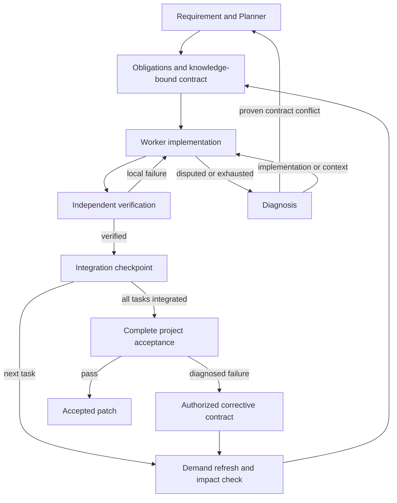

<p align="center">
  
</p>

<h1 align="center">Pi Coordination Harness</h1>
<p align="center"><strong>Pro 与 Flash 协作，把需求推进成可验证的补丁。</strong></p>
<p align="center">
  <a href="README.md">English</a> · <strong>简体中文</strong>
</p>
<p align="center">
  <a href="LICENSE"></a>
  
</p>


**Pi Coordination Harness 将 Pro / Flash 协作变成一套可以从终端运行的开发流程。** 给它一个仓库和一项需求：Pro 组织任务，Flash 推进实现，通过验证后交付补丁。

V0.3 把需求、知识、契约、诊断与集成验收连接成闭环：Pro 做项目决策，Flash 推进实现，独立审查验证语义依据，最终失败进入有界修复，Git 检查点支持续跑。详见 [完整项目机制](docs/MECHANISM.zh-CN.md) 和 [实施计划](docs/IMPLEMENTATION_PLAN.md)。

<p align="center"><a href="#你能得到什么">核心能力</a> · <a href="#快速开始">快速开始</a> · <a href="#一项需求如何流转">协作流程</a> · <a href="#查看与应用结果">交付结果</a></p>

## 你能得到什么

| 能力 | 带来的价值 |
| --- | --- |
| **角色专用 Agent loop** | Pro 按项目事件完成决策后退出，Flash 在任务内保留实现与调试历史。 |
| **架构层 Planner** | 查询模块、接口、约束与影响范围，通过 Evidence Request 按需获取证据。 |
| **独立知识与检索角色** | Knowledge Builder 和 Scout 使用只读快模型会话，默认采用 Flash 配置。 |
| **分层 Project IR v3** | 区分假设、经审查事实、脏记录与作者决策；按需刷新。 |
| **每项任务独立会话** | Flash 在重试中保留自己的编辑、测试和调试上下文。 |
| **临时 Git worktree** | 候选修改在独立工作区进行，与原始 checkout 分开。 |
| **逐项义务验收** | 需求、验收与约束有明确覆盖，必选义务缺证据就停止接受。 |
| **诊断与整体修复** | 先确认失败原因，再补上下文、升级实现或重规划；修复后完整复验。 |
| **可恢复集成进度** | 保留 Git 引用与检查点，续跑跳过已经集成的任务。 |
| **可审阅的补丁** | 获得 `final.patch`，同时保留任务结果与验证记录。 |

核心在于**按需协作**：任务内的迭代交给 Flash，需要项目级决策时再由 Pro 参与。遇到复杂的局部实现，也可以保留原有任务契约，配置 Pro 模型接手。

## 快速开始

**运行环境：** Linux 或 macOS 上的 Node 22.19+、npm、Git 和 bash；Windows 使用 WSL2。在 Pi 中配置模型认证。Linux shell 沙箱还需要 `bubblewrap`、`socat`、`ripgrep`。

### 1. 构建框架

下载或克隆本仓库后执行：

```sh
npm ci
npm run build
cp pi-coordination.config.example.json pi-coordination.config.json
```

### 2. 选择 Pro 与 Flash 模型

编辑 `pi-coordination.config.json`，填入自己在 Pi 环境中可用的供应商和模型 ID。最小配置如下：

```json
{
  "pro": {
    "provider": "YOUR_PRO_PROVIDER",
    "model": "YOUR_PRO_MODEL"
  },
  "flash": {
    "provider": "YOUR_FLASH_PROVIDER",
    "model": "YOUR_FLASH_MODEL"
  },
  "verification": {
    "finalCommands": ["npm test"]
  }
}
```

替换模型占位符，将验证命令改为**目标项目实际使用的命令**。[完整示例](pi-coordination.config.example.json)还包含沙箱与重试设置；如需由 Pro 接手复杂实现，可配置 `proWorker`。Pro 和 Flash 表示角色，不绑定特定供应商。可选 `scout` 可单独指定知识构建与证据检索模型，否则沿用 Flash。可选 `reviewer` 指定独立语义审查模型，默认采用 Pro。`plannerContext` 默认每轮决策提供 12000/2000 的架构/源码预算和 6 次证据请求；前两者按 UTF-8 字节保守估算，不是供应商精确 token 数。

### 3. 提出需求

目标 Git 仓库需要至少有一次提交。在框架目录运行：

```sh
node dist/cli.js run \
  --repo /path/to/your-project \
  --config ./pi-coordination.config.json \
  --requirement "为搜索增加游标分页，保持现有响应字段兼容"
```

长需求可以使用 `--requirement-file request.md`。希望直接使用命令名时，运行 `npm link`，之后使用 `pi-coordination-harness run ...`。

## 一项需求如何流转



计划先枚举需求，为必选需求建立项目义务；任务验收与约束映射到命令、源码断言或独立语义审查。候选自报完成不构成接受。必选义务通过、实际改动符合范围且检查没有改写候选，才允许集成。

集成后先标脏，下一任务真正依赖相关知识时再刷新和审查。只有受影响的待执行契约重签版本并使用新会话。Worker 的冲突声明先经过独立诊断，Planner 接收有基准证据的语义事件。

最终重跑原项目义务、已集成任务的必选义务和验证命令。失败产生原授权范围内的纠正任务；默认最多两轮，超限仍保留检查点。整体通过后才激活有证据的决策并导出补丁。状态和完整流程见 [机制说明](docs/MECHANISM.zh-CN.md)。

## 查看与应用结果

命令返回运行 ID、已接受任务、补丁路径和指标路径。产物保存在目标仓库中：

| 位置 | 内容 |
| --- | --- |
| `.agent-orch/project/` | 带版本和证据状态的知识与检索缓存、作者决策 |
| `.agent-orch/runs/<run-id>/tasks/`、`outcomes/` | 已派发契约版本和局部执行历史 |
| `*.verification.json`、`evidence/`、`diagnostic-*.json` | 实际检查、证据与诊断 |
| `planner-*`、`plan-delta-*`、`project-delta-*` | 决策视图、暂缓、事件与影响传播 |
| `checkpoint.json`、`task-state-*`、`metrics.json` | 恢复状态、任务阶段与角色指标 |
| `final.patch` | 整体接受后的补丁 |

环境恢复后，用原配置和原基准 HEAD 续跑：

```sh
node dist/cli.js resume --repo /path/to/your-project \
  --config ./pi-coordination.config.json --run-id <run-id>
```

集成提交保留在 `refs/pi-coordination/runs/<run-id>/integration`。续跑跳过已集成任务；有效计划形成前的早期失败，解决问题后新开运行。

检查补丁后，在目标仓库中使用实际返回的运行 ID：

```sh
git apply --check .agent-orch/runs/<run-id>/final.patch
git apply .agent-orch/runs/<run-id>/final.patch
```

工作区从已提交的 `HEAD` 创建，开始前先提交希望参与本次任务的修改。若任务上下文应留在本地，可在目标项目中忽略 `.agent-orch/`。

## 看得懂，也改得动

协作循环用 TypeScript 实现，各角色提示词独立保存在 Markdown 文件中。你既能检查运行逻辑，也能直接阅读每个模型收到的指令。

| 目录 | 适合从这里探索 |
| --- | --- |
| `src/runtime/` | 任务调度、重试路由、产物与用量统计 |
| `src/planner/` · `src/worker/` | Pro 架构查询与证据工具、Flash 任务执行循环 |
| `src/project/` | 持久化 IR、已提交源码索引、Knowledge Builder 与 Evidence Scout |
| `src/workspace/` · `src/verifier/` | 候选工作区、验收和补丁导出 |
| `prompts/` | 项目理解、任务交接与模型指令 |

```sh
npm run check
```

从 [架构文档](docs/ARCHITECTURE.md)、[协议与一致性测试](docs/PROTOCOL.md) 或 [提示词设计](docs/PROMPT_DESIGN.md) 开始。模型路由、集成和验证方面的贡献都很欢迎，详见 [贡献指南](CONTRIBUTING.md)。

基于 [Pi](https://github.com/earendil-works/pi) 构建，采用 [MIT 许可证](LICENSE)。

<sub>当前版本适配、验证覆盖及运行边界见 [验证记录](docs/VALIDATION.md)。</sub>

## 从 V0.1 / V0.2 升级

已有 JSON 配置仍可使用，新增诊断、修复和暂缓预算采用默认值。旧 IR 升级为 v3 待审查知识，缺少作者依据的旧决策保留为 superseded。新任务不能只有字符串验收，必须声明 obligations 覆盖；旧运行记录没有新检查点，不能直接续跑。代码调用方须补齐 HarnessConfig、ProjectPlan、TaskContract 新字段。

缓存可以标识拟集成版本，不代表原 checkout 已修改；应用并提交补丁后，同一代码树可复用证据。真实模型质量、OS 沙箱和成本收益仍需实际环境验证，见 [验证记录](docs/VALIDATION.md)。
