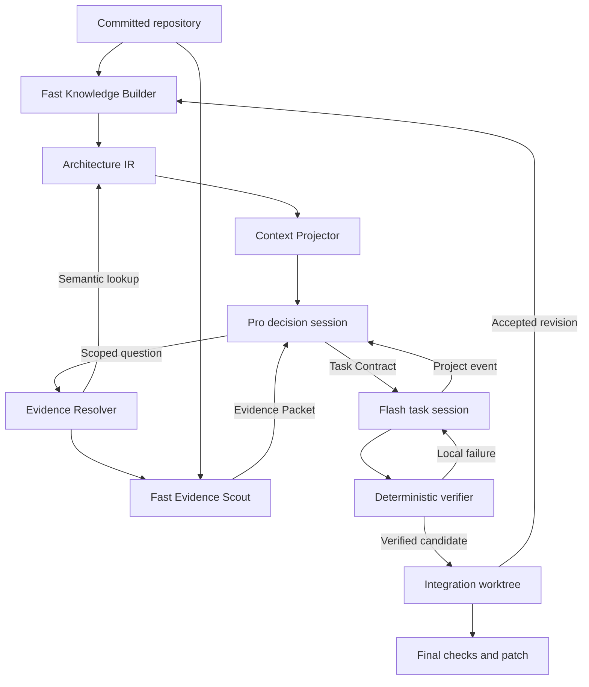

# Architecture — V0.2

Pi supplies sessions and model/tool execution. The harness assigns different
context sources, tools, control flow and lifetimes to each role.

## Roles and loops

| Role | Default context | Tools | Lifetime / terminal action |
| --- | --- | --- | --- |
| Knowledge Builder | Inventory, previous IR, changed committed files | Read-only repository inspection, `commit_project_ir` | Separate fast-model session per bootstrap/refresh |
| Pro Planner | Bounded Architecture View, requirement, current plan on replan, semantic project event | Architecture inspection, `request_evidence`, `commit_plan` / `commit_plan_delta` | Fresh session for one project decision |
| Evidence Scout | Scoped question and decision relevance | Read-only snapshot inspection, `submit_evidence` | Fresh fast-model session per semantic lookup |
| Flash Worker | One TaskContract, relevant modules/capabilities, global constraints | Read/edit/write and sandboxed bash, `submit_outcome` | Same task session across local retries |
| Strong Worker | Same contract, previous implementation failure | Worker tools | Optional fresh implementation session; no planning authority |

`scout` defaults to the Flash profile and supplies both knowledge operations.
It is independent of the Pro Planner profile. Metrics record `knowledgeBuilder`
and `scout` separately from planning.

The Planner never receives built-in `read`, `grep`, `find`, `ls`, `bash`, `edit`
or `write` tools. It can inspect modules, interfaces, reusable capabilities,
transitive impact and project constraints. It asks questions through
`request_evidence`; it cannot browse a worker transcript or arbitrary host files.
Automatic Pi context-file, extension and skill discovery is disabled for all roles.
Registered safety extensions remain active.

Terminal hooks abort a role turn after successful artifact capture and block
further tools. They also apply a 64-tool-call cutoff per invocation. A worker
retry starts another invocation in the same session. Completion without the
required artifact is an error, not implicit acceptance.

## Architecture knowledge and projections

Project IR v2 contains module responsibilities/exclusions, public surfaces and
associated tests; interface ownership/stability; capabilities; global invariants;
dependency edges; structured decisions and their rationale/rejected alternatives;
and unresolved facts. Evidence locators tie claims to source/docs/tests.

A deterministic lexical index supplies relative JS/TS import edges. It is not a
compiler graph: aliases, dynamic loading and other languages require semantic
Scout evidence. Regex matches can be false positives; an indexed edge is a lead,
not proof of runtime behavior.

The Planner projector retains a global module map and prioritizes constraints,
related decisions, relevant modules and direct dependency neighbours. Omitted
counts make truncation explicit. The Worker gets a task slice rather than the
complete global architecture prose. Additional Worker context is resolved from
IR and its existing local repository tools without waking Pro.

`architectureTokens`, `rawCodeTokens` and `evidenceRequests` are per-Planner-turn
budgets. The first two use serialized UTF-8 byte counts as conservative token
proxies, not provider token accounting. Defaults are 12000, 2000 and 6. The
architecture counter includes the initial view and successful semantic tool
responses; it excludes prompts, current-plan text and conversation overhead.
Source counters cover explicitly returned excerpts. They cannot detect code
copied into a model-produced semantic field.

## Evidence channel

Interface/dependency questions first use IR. Caller/test/behavior questions go
to a read-only fast Scout in a detached snapshot of the indexed commit. Scout
claims carry exact committed file/line evidence, confidence, exceptions and
uncertainty; the runtime verifies that referenced files exist at that revision.
Semantic correctness still requires model judgment; existence is not entailment.

Raw excerpts require preceding semantic evidence for the same decision, a
scoped tracked file, a named unresolved ambiguity, valid 1–80 line bounds and
remaining source budget. Excerpts come from Git blobs, so dirty checkout edits,
path escapes and untracked host files cannot enter through this channel.
Files over 256 KiB and binary files are refused. Denied read paths are refused.
Requests and resulting packets are saved as evidence artifacts.

## Event and retry routing

| Signal | Runtime action | Planner wakeup |
| --- | --- | --- |
| Initial requirement | Build/reuse IR, create initial task graph | Yes |
| `candidate_ready` | Independent scope/check verification; integrate only on success | No |
| Test/verification failure | Retry the same Worker; bounded stronger implementation escalation if configured | No |
| `needs_context` | Resolve additional IR context; continue the same Worker | No |
| `local_failure` / `budget_exhausted` | Bounded local retries, then optional Strong Worker under the same contract | No |
| `environment_failure` | Record failed run; no automatic architecture replan | No |
| `contract_conflict` | Dispose Worker, remove candidate worktree, send bounded semantic conflict | Yes |
| `blocked` + explicit architectural/dependency `projectIssue` | Same project-event path | Yes |
| Unclassified `blocked` | Record failed run | No |
| Scheduler has no executable unfinished task | Request task graph replan | Yes |

Only the semantic conflict/project issue and an archive reference cross the
Worker/Planner boundary. Diff bodies, check logs, changed-file lists and ordinary
worker summaries remain in execution artifacts. New evidence is requested
against accepted integration state. Replans are limited to eight per run.

PlanDelta validation rejects unknown/colliding task IDs, ineffective changes,
inconsistent dependencies and retroactive changes to accepted tasks. A triggering
contract must be revised or retired. Revised tasks increment contract versions;
a changed contract cannot resume the old Worker session. All contract versions,
outcomes, views, events and deltas remain in the run history.

## IR lifecycle and acceptance

Canonical knowledge lives under the original repository's `.agent-orch/project/`.
Fresh v2 knowledge at the same committed revision is reused. V1 or stale knowledge
is refreshed by the Knowledge Builder. A revision change supplies prior knowledge
plus the committed changed-file set. Inventories ignore staged/uncommitted files.

After each verified task integration, a fast semantic refresh targets accepted
changes and updates the in-run IR snapshot without invoking the Planner. That
snapshot describes the proposed integrated revision. The original checkout's IR
remains anchored to its original commit because the final patch is not applied
there automatically. Applying and committing it triggers the next canonical
refresh. An IR refresh failure stops the run rather than using stale knowledge.

Task candidates execute in detached Git worktrees. Bash uses the pinned
`@anthropic-ai/sandbox-runtime`; file tools have lexical/symlink path guards.
Actual diff scopes are independently checked after verification commands.
Only verified candidates are cherry-picked into the integration worktree.
Final checks must not leave tracked modifications or newly created unignored files
outside the exported committed state. A successful run exports `final.patch`; source edits stay out of the
user checkout. Project/run metadata is written there under `.agent-orch/`.

## Boundaries

V0.2 is serial. It does not schedule parallel Workers, recover arbitrary process
crashes, roll back accepted tasks, or provide full program analysis. Structured
semantic fields are model-produced, not a formal guarantee against source leakage
or incorrect architectural interpretation. See [protocol](PROTOCOL.md) and
[validation](VALIDATION.md) for concrete interfaces and checked behavior.
