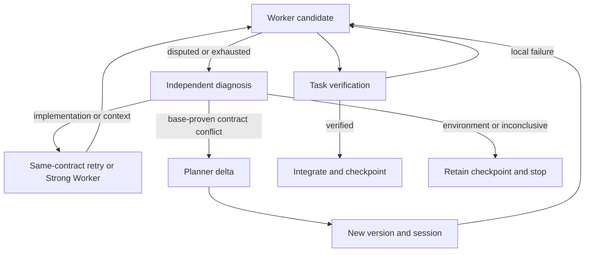

# Architecture — V0.3

Pi Coordination Harness runs serial, isolated coding tasks under immutable, verifiable contracts. The final artifact is a patch for an accepted integration state. The runtime, not model self-report, controls transitions.

The detailed Chinese walkthrough is [MECHANISM.zh-CN.md](MECHANISM.zh-CN.md); the six-gap implementation plan is [IMPLEMENTATION_PLAN.md](IMPLEMENTATION_PLAN.md).

## Control and authority

| Component | Authority | Lifetime |
| --- | --- | --- |
| ProjectRuntime | Validate graph/coverage, bind knowledge, schedule, integrate, checkpoint, repair and export | One run or explicit resume |
| Knowledge Builder | Propose source-backed module/interface/capability/constraint records | Read-only committed-snapshot session |
| Evidence Scout | Answer a scoped decision question, including exceptions and uncertainty | Read-only committed-snapshot session |
| Pro Planner | Author requirements, acceptance obligations, contracts, deltas and decisions | Fresh bounded decision session |
| Worker / optional Strong Worker | Implement within one task id/version/base/scope | Persistent unchanged-contract session; fresh session for capability escalation |
| Independent Reviewer | Assess semantic support of obligations or knowledge candidates | Bounded evidence-only session, no repository tools |
| Diagnoser | Classify observed failure against contract and pinned base facts | Bounded evidence-only session |
| Repair Coordinator | Choose a corrective scope inside original authorization | Bounded session; runtime attaches original failing checks |
| Verifier / WorkspaceManager | Inspect exact candidate state; execute checks; commit/cherry-pick verified changes | Deterministic runtime code |

Roles use explicit tool allowlists, terminal capture and tool-call limits. They do not load ambient extensions, skills, prompt templates or arbitrary repository context through Pi. Worker path policy and sandbox configuration govern the tools; final actual-diff checks enforce write scopes independently.

## Knowledge is not a revision label

Project IR v3 includes repository inventory, semantic architecture, conservative relative-import dependencies, uncertainty, authored decisions and a knowledge catalogue. Each KnowledgeRecord has a semantic digest, source scope, evidence-scope fingerprint, pinned references, provenance, validation and freshness.

Builder output begins as a hypothesis/candidate. File and line validation establish valid references, not entailment. An independent Reviewer assesses critical statements. Corroborated fresh statements are factual inputs; rejected/dirty/unverified statements do not permit dispatch under a dependent contract. Deterministic import facts claim an indexed textual import relationship, not full dynamic/runtime dependency knowledge.

Scout packets are independently assessed and written back into the reusable catalogue, including rejected or uncertain claims. Evidence cache entries key on the exact Git tree and scoped question; identical trees can reuse pinned claims after revision rebinding. Different trees cannot silently reuse cached positive or negative caller evidence.

Integration marks affected records dirty and writes a ProjectDelta. It does not invoke a full model refresh. The next task demands only its bound dependencies plus necessary ownership context. Focused refresh merges selected records, explicitly handles removals and permits source-grounded new capabilities/constraints in affected modules. Unrelated dirty knowledge may remain deferred in the cache.

After refresh, semantic digest changes, removed/rejected records and new global constraints trigger impact analysis on pending contracts. Planner revises/retires affected tasks; integrated tasks remain immutable. Implementation-only changes with unchanged corroborated architecture do not require replanning. This analysis is conservative and only as complete as indexed scopes and model-produced architecture.

## Planner context and deferral

Planner has architecture queries, `inspect_task` for current replan contracts, scoped evidence and a limited excerpt channel. No raw filesystem or shell tool is available. Architecture projections prioritize global invariants, unknown/dirty records and critical dependencies; omitted counts retain visibility of missing information. Full architecture prose and Worker transcripts are not injected automatically.

Per session, architecture data, explicit source and evidence requests have hard limits. Byte proxies are distinct from provider token/cost metrics. The initial view reserves room for query responses. When missing evidence changes a decision, `defer_decision` terminates the session; runtime retrieves scoped evidence and starts a fresh bounded session with prepared packets. Default: at most two deferrals. Unresolved decisions stop rather than forcing an unsound contract. Rolling milestone planning is not implemented.

## Acceptance and immutable contracts

The plan enumerates Requirement ids and mandatory project-level obligations. Task obligations cover every acceptance/constraint index and refer to known requirements. Checks are commands, literal source assertions or scoped semantic reviews. Required obligation states must all be `verified`; `violated` and `unverified` block acceptance. Optional results remain visible. A successful generic command cannot establish unrelated behavior merely because it has been assigned a requirement id; authors must choose appropriate checks.

Contract knowledge dependencies include explicit refs and structural refs derived from write scopes/hints: modules, owned interfaces, dependency records, capabilities and global constraints. Dispatch requires matching digests and fresh corroborated records. Contract revisions increment versions and get new worktrees/sessions. Same-contract local retries retain Worker history.

Candidate verification checks actual tracked/staged/untracked state, write scope and non-empty change, runs checks and reviews, and fingerprints state before/after. Any source/unignored-state mutation invalidates evidence. The runtime checks the fingerprint again immediately before commit. Original checkout changes are never used as implicit task input.

## Diagnosed escalation and project repair

Worker status is a claim. Diagnoses reference actual obligation/bound-knowledge statements, expected/observed facts and pinned base evidence. Only assessed contract contradictions become Planner events. Implementation/context failures stay local or escalate under the same contract; environment/inconclusive failures retain progress and stop. Default: two diagnostic calls per task and one optional Strong Worker handoff.

Task states distinguish `task_verified`, `integrated_pending`, and `project_accepted`. After all tasks integrate, final verification repeats original project obligations, mandatory integrated-task obligations, integrated task verificationCommands, and configured/planned final commands.

If final verification fails, restore the isolated integration worktree to its committed state and diagnose. Implementation/context findings generate a corrective contract inside the existing authorization; runtime preserves the failed checks. The correction goes through normal Worker/Verifier/integration, then full acceptance repeats. Architectural contradictions use forward Planner changes. Default: two final repair rounds, persisted across resume. Oscillation is bounded. No patch is exported before complete acceptance.

## Decisions and durable recovery

Planner decisions carry rationale, rejected alternatives, task links and explicit knowledge/evidence/requirement ids. The runtime copies their historical basis, including statement, digest, revision and references. Builder cannot invent or replace rationale. Proposals become active only with corroborated bases, integrated linked tasks and complete project acceptance. Cancelled links supersede proposals. Legacy unproven decision records are retained as superseded background.

Each stable transition saves an atomic JSON checkpoint and retains the integration commit with `refs/pi-coordination/runs/<run-id>/integration`. Checkpoints include requirement, config fingerprint, original base, integration revision, plan, knowledge, integrated/cancelled tasks, versions, budgets and metrics. Temporary worktrees can be removed without losing reachable progress.

Explicit `resume --run-id` requires original config/base HEAD, validates retained history, recreates the checkpoint worktree and skips integrated tasks. Unfinished tasks get fresh sessions. A per-run process lease refuses overlapping resume; a dead process owner can be reclaimed. Completed runs keep their verified patch. Early failure before a valid plan has no task checkpoint and requires a new run after fixing the cause. OS-process leases and worktree management assume one local host.

Run artifacts archive versions, outcomes, evidence, verification, views, deferrals, events, plan/knowledge deltas, diagnoses, states, metrics and final patch. Project knowledge is a revision-tagged cache and can describe proposed integration, so it is not proof that the original checkout already contains a change.

## Operational limits

Models are simulated in conformance tests; Git/filesystem/patch operations are real. Live provider authentication, model quality, OS sandbox enforcement, large-project scale and performance/cost gains are not established by these tests. Semantic review is evidence-backed model judgment, not formal proof. The scheduler is serial; no distributed/parallel task consensus or rolling milestone protocol is claimed. See [VALIDATION.md](VALIDATION.md).
