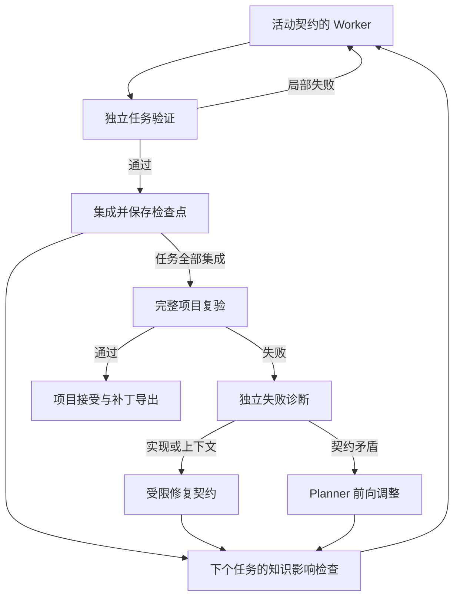

# Pi Coordination Harness V0.3 完整项目机制

这个项目把一项开发需求转化为可复验的 Git 补丁。它保留 Pro 做项目决策、Flash 做局部实现的分工，同时把知识、契约、失败诊断和集成验收连接成闭环。模型提出判断和候选修改，运行时控制调度、版本、证据、预算和状态转换。

## 1. 本轮修复的六项问题

| 原机制缺口 | 修复后的规则 | 主要实现 |
| --- | --- | --- |
| 验收与约束只是字符串 | 需求有稳定 id；任务与项目都有显式验证义务；必选义务逐条有证据才能通过 | `verifier/obligations.ts`、`verifier/verifier.ts` |
| 知识刷新没有使旧契约失效 | 契约绑定知识 id/digest；改动产生脏记录与 ProjectDelta；派工前检查受影响的待执行契约 | `project/knowledge.ts`、`knowledge-coordinator.ts` |
| 最终失败后直接丢弃集成状态 | 保留 Git 检查点；诊断后建立受限修复契约；重新执行原项目和已集成任务的检查 | `runtime/project-runtime.ts`、`repair-coordinator.ts` |
| Worker 的冲突声明直接唤醒 Planner | 声明先经过独立诊断；只有有基准证据的契约矛盾才进入项目决策 | `runtime/diagnoser.ts`、`events.ts`、`worker/task-loop.ts` |
| 事实、猜测和决策混在一起，检索没有回流 | 模型摘要先作为假设；独立审查支持后成为事实；Scout 写回知识；Planner 作者决策保留历史依据 | `project/knowledge*.ts`、`verifier/semantic-reviewer.ts` |
| 每次集成都全量刷新，预算不足仍被迫决策 | 先标脏，按当前任务依赖刷新；同一代码树复用证据；关键未知项优先；支持 defer_decision | `knowledge-builder.ts`、`architecture.ts`、`planner-runtime.ts` |

具体实施顺序和验收依据见 [实施计划](IMPLEMENTATION_PLAN.md)。

## 2. 角色和控制权

| 角色 | 负责什么 | 可以做什么 | 结束产物 |
| --- | --- | --- | --- |
| Knowledge Builder，默认 Flash | 建立或局部刷新架构目录 | 在已提交版本的只读工作区检索；提交有来源的语义记录 | `commit_project_ir` |
| Evidence Scout，默认 Flash | 回答一个会改变决策的具体问题 | 在指定提交中查接口、调用方、测试及行为，返回有边界的证据 | `submit_evidence` |
| Pro Planner | 需求拆解、接口取舍、任务边界与受影响契约重签 | 架构查询、检索请求、有限源码摘录；没有直接读写源码或 shell 工具 | `commit_plan`、`commit_plan_delta` 或 `defer_decision` |
| Flash Worker | 在同一契约下实现、测试、修复 | 任务工作区里的检索、编辑和沙箱命令；受写范围和独立验收约束 | `submit_outcome` |
| Strong Worker，可选 | 处理已诊断的实现或上下文困难 | 新会话接手同一契约、同一候选工作区 | `submit_outcome` |
| Independent Reviewer，默认 Pro | 审查语义义务及知识声明是否由证据支持 | 只接收有上限的源码材料，提交逐项结论；不能编辑或执行命令 | `submit_review` |
| Diagnoser，默认 Flash | 判断失败属于实现、上下文、环境或契约 | 对照真实检查、活动契约和固定基准源码 | `submit_diagnosis` |
| Repair Coordinator，默认 Flash | 将最终集成失败转成一个纠正任务 | 选择原授权范围内的文件和写范围；不能删改原验收义务 | `commit_repair_task` |

调度器与验证器是确定性代码，不是拥有自由裁量权的常驻模型。强模型只在项目决策、独立语义审查或已诊断的复杂实现中使用。角色名称不绑定某个供应商。

## 3. 输入、基准和知识目录

运行输入是目标 Git 仓库、模型/沙箱配置和需求文本。运行从原 checkout 的已提交 HEAD 取基准，创建独立集成 worktree；所有候选任务再从当前集成 HEAD 创建自己的 worktree。原 checkout 的未提交文件不参与知识构建和候选任务，也不会被运行时改写。

首次运行用确定性清单列出已提交文件、语言、manifest 和目录，再让 Knowledge Builder 检索模块职责、接口、复用能力、约束及不确定项。JS/TS 相对导入另有保守的确定性索引；它记录可索引的导入，不能推断所有动态调用或运行依赖。

Project IR v3 同时保存语义目录和 KnowledgeRecord。每条记录包含稳定 id、statement、sourceScope、固定版本的 EvidenceRef、语义 digest、证据范围指纹、来源以及两组状态：

- `candidate / corroborated / rejected` 表示证据是否支持声明。
- `fresh / dirty` 表示记录的证据范围是否受后续代码改动影响。

模型摘要最初是 hypothesis。置信度高、文件存在或提交号匹配，都不能自动把它变成事实。独立 Reviewer 对实际源码审查后，支持的声明才成为 fact；反证保存为 rejected，材料不足仍是 candidate。确定性导入记录的事实含义限定为“存在这个被索引的导入关系”。

`.agent-orch/project/` 是带版本标识的知识缓存，可以包含拟集成提交的知识；它不代表原 checkout 已应用补丁。下一次运行先对比 HEAD 与缓存提交，按代码变化使记录失效；相同代码树可以复用原证据与审查。

## 4. Planner 的输入和暂缓决策

Planner 首先收到 ArchitectureView，包含有限的模块图、相关接口、能力、约束、决策、知识状态和 omitted 计数。它不会自动收到全部架构正文、全部源码或 Worker 调试轨迹。

投影按相关性、契约关键引用、脏记录及不确定性分配空间。全局约束和未知项优先于大量局部描述。缺少上下文时，Planner 可以调用架构查询工具；重规划还可用 inspect_task 按 id 读取完整现有任务。

EvidenceRequest 必须明确“缺什么事实、影响哪个决策、查哪些文件/模块/符号”。Scout 返回声明、引用、异常和未知项。运行时检查提交、范围和行号，Reviewer 再检查语义支持，并把检索结果写回知识目录。明确的源码摘录必须先有同一决策的语义检索，再说明会改变判断的歧义；一次摘录最多 80 行。

每轮默认限额为 12000 架构数据字节、2000 显式摘录字节、6 次检索。这些 UTF-8 字节是保守代理，不是供应商精确 token 统计。视图不会一次占满预算，给后续查询和证据保留空间。

关键事实仍不足时，Planner 用 defer_decision 结束本轮。运行时先做受限检索，再建立一个没有旧轨迹的新 Planner 会话，并提供准备好的证据。默认最多暂缓 2 次；继续缺证据时停止并报告未解决决策，不强行派工。这个版本没有实现滚动里程碑协议。

## 5. 需求、计划与可验证契约

ProjectPlan 先枚举 Requirement：id、description 和 mandatory。每个必选需求必须有必选 projectObligation，检查的是最终集成结果，而不是某个 Worker 自报的完成情况。

每项 TaskContract 绑定任务 id、契约 version、baseRevision、goal、writeScopes、dependencies、contextHints、约束、验收、obligations 和 knowledgeRefs。运行时还从写范围与上下文自动绑定结构相关的模块、接口、依赖和全局约束，不能靠删除 contextHints 隐藏结构依赖。

一个验证义务明确自己的 id、requirementId、描述、类别、是否必选，以及检查方式。类别是 behavior、interface 或 invariant；检查有三类：

| 检查方式 | 可以证明什么 | 证据 |
| --- | --- | --- |
| command | 被选测试、编译器或验证程序检查到的性质 | 命令、退出码、输出和候选指纹 |
| source | 某个文件中明确的文本存在/不存在条件 | 源码路径、断言结果和候选指纹 |
| review | 难以自动化的具体语义问题 | 独立审查结论及限定文件/行引用 |

源码字符串断言只证明文本条件；业务行为应尽量用可执行行为测试。每个 acceptanceCriteria[N] 必须被必选义务的 `acceptance:N` 覆盖，每个 constraints[N] 必须被 `constraint:N` 覆盖。义务 id 在计划内唯一，需求引用有效。旧式只有字符串、没有义务的契约会被拒绝。

每条义务输出 verified、violated 或 unverified。必选义务全部 verified，范围与候选状态检查也通过，任务才算通过。可选义务的失败保留在报告中。verificationCommands 可以为空，但显式必选义务不能因此消失。

计划还检查任务 id、重复任务、依赖缺失和环。串行调度器每次选择依赖已经集成的 ready 任务，不启动尚未满足前置条件的任务。

## 6. 派工前的知识影响检查

一次任务集成后，运行时根据实际 Git diff 标记受影响知识为 dirty，保存 ProjectDelta。这里不立即启动全量语义刷新，也不因为有任何改动就唤醒 Planner。

下一任务派发前，只需求化刷新它绑定的记录及必要接口归属。局部 Builder 接收限定目录和结构化片段，返回部分记录；运行时保留其他知识，明确处理删除，并允许在受影响模块内发现新的能力或约束。关键候选声明随后接受独立审查。

刷新后的语义 digest 与契约绑定值不同、引用被删除，或声明被反证时，运行时计算受影响的待执行任务，先提交 ARCHITECTURE_ASSUMPTION_INVALIDATED。新增全局约束会影响待执行契约。Planner 必须修订或退役受影响任务；未受影响的任务保持原版本。

修订任务 version 加一，使用新集成基准、新 worktree、新 Worker 会话。未验证候选被移除，旧调试上下文不会进入新契约。已集成任务不能被追溯改写，缺陷用前向纠正任务处理。

如果只是实现内容变化，而经过重新审查的语义声明没有变化，契约继续有效。证据不足也不能视作继续有效：运行时让 Planner 补证据或修订假设，持续无法解决时有界停止。

## 7. 局部实现、验收与失败诊断

Worker 的会话在同一契约重试时保留。needs_context 获得额外局部材料；候选失败收到真实验证反馈；默认快速尝试 2 次，另有最多 2 次候选验证修复重试。Strong Worker 仅在独立诊断认为属于实现或上下文困难时接手，沿用契约和候选文件，但采用新会话。

独立 Verifier 运行命令和各项义务，检查真实 staged/untracked/工作区变化、写范围和非空改动。检查前后比较候选指纹；命令或审查期间改了源码/未忽略文件，证据全部变成 unverified。验收后到提交前也再次检查指纹，避免把不同候选当作已经验证。

Worker 的 contract_conflict、blocked、projectIssue 是待检查声明。明确冲突、上下文耗尽、环境失败或实现无进展时进入独立诊断，每任务默认最多 2 次诊断调用。诊断分类决定后续路径：

| 分类 | 路由 |
| --- | --- |
| implementation | 同契约局部修复，预算耗尽时允许可选 Strong Worker |
| context | 同契约补上下文，仍受尝试预算约束 |
| environment | 停止本次执行、保留检查点，修复环境后显式续跑 |
| contract | 必须有具体义务/绑定知识的 expected/observed 矛盾和基准提交证据；结束当前 Worker 后交 Planner |
| inconclusive | 不猜测路由，有界停止并保存记录 |

Planner 收到的是短语义摘要和诊断证据 id，普通 diff、命令输出和 Worker 原始轨迹留在执行产物中。事件原因由诊断和实际知识影响产生，而不是由 Worker 标签决定。

## 8. 项目级集成、复验和修复



状态明确区分 task_verified、integrated_pending 和 project_accepted。任务通过自己的检查，只能成为已验证候选；提交合入集成 worktree 后仍是 integrated_pending。

全部任务集成后，最终检查重跑原 projectObligations、已集成任务的必选义务、它们的 verificationCommands，以及计划和配置的 finalCommands。最终阶段不能直接改源码获得成功，也不能在修复时丢掉最初失败的检查。

失败先诊断。如果是实现/上下文问题，Repair Coordinator 在原任务授权范围内选择纠正范围。运行时把失败义务原样附到新修复契约，检查与实现继续走正常 Worker/Verifier/Integration 流程，然后重跑完整项目验收。若证据表明架构契约有矛盾，才调用 Planner 增加前向纠正工作。

默认最多 2 轮项目修复；计数随检查点保存。修复在 A、B 两个错误间来回震荡，也会在预算边界停止。整体通过之前不会导出 final.patch，已经集成的工作仍可审查和恢复。

## 9. 决策写回、持久化和恢复

Planner 决策包含 area、summary、rationale、rejectedAlternatives、关联 taskIds 和证据 id。证据可以来自知识/检索，也可以是 `requirement:R1`。保存时复制当时的陈述、digest、提交和引用作为历史 basis；后来 live catalogue 更新不会把决策依据改成新内容。

决策初始 proposed。只有历史依据被支持、关联任务全部集成且整个项目通过，才激活为 active。取消关联工作则 superseded；旧版本由 Builder 生成、缺乏作者来源的决策作为 superseded 背景保留，不能自动激活。

每次计划更新和任务集成都保存 checkpoint.json，并让 Git 引用 `refs/pi-coordination/runs/<run-id>/integration` 指向集成提交，使临时 worktree 清理后提交仍可达。检查点包含原始需求、基准、集成提交、计划、IR、已集成/取消任务、契约版本、修复和重规划计数、配置指纹及指标。

环境恢复后可执行：

```sh
node dist/cli.js resume --repo /path/to/project --config ./pi-coordination.config.json --run-id <run-id>
```

续跑要求原配置和原 checkout 的基准 HEAD，校验检查点属于保留的 Git 历史。它重建集成 worktree，跳过已经集成的任务，只重新启动未完成任务的新 Worker；同一运行有进程锁，拒绝并发续跑。完成的运行直接使用原已验证补丁，不再重复续跑。未形成有效计划的早期失败没有可续跑的任务检查点，应解决输入/模型问题后新开运行。

同一契约的 attempt 计数跨续跑递增，重复环境失败也不会覆盖早先记录。运行记录还保留每个已派发契约版本、Worker outcome、检查结果、结构化证据、Planner 视图/暂缓/事件、PlanDelta、ProjectDelta、诊断与各角色指标。source patch、检查点和项目接受是不同产物，不应仅凭一个任务自报 candidate_ready 判定整体完成。

## 10. 已验证范围和现实边界

本轮自动测试使用模拟模型会话，但仓库、文件、worktree、提交、恢复和补丁检查是真实操作。测试覆盖六项修复的正常与失败路径，包括未证实义务、依赖失效、误报冲突、整体修复、环境中断恢复、修复震荡停止、知识回流、证据复用和决策历史。

真实供应商调用、模型判断质量、大仓库成本/延迟收益和操作系统沙箱执行效果尚未由这些测试验证。语义审查是有证据的独立模型判断，不能替代形式化证明；依赖索引也是保守索引。运行仍按串行任务推进，角色数增加不意味着自动并行编排。具体检查结果见 [验证记录](VALIDATION.md)。
